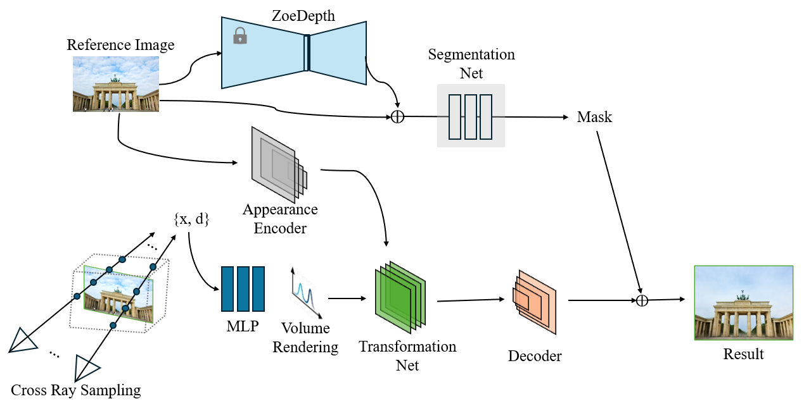
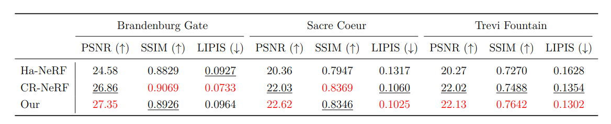

# Cross-Ray Neural Radiance Fields in the Wild via Monocular Depth Guidance

<p align="center">
  
  
</p>

## About
> **NYCU Computer Vision Final Project**\
> Group 29\
> Group Member: 蔡師睿、林書楷、劉又輔

## Pipeline
<p align="center">
  
</p>

## Results
<p align="center">
  
</p>

## Installation
Check [installation.md](https://github.com/Shukkai/CR-NeRF-via-Depth-Guidance/blob/main/docs/installation.md)

## Dataset
Check [dataset.md](https://github.com/Shukkai/CR-NeRF-via-Depth-Guidance/blob/main/docs/dataset.md)

## Evaluation
**Video Demo**
```bash
# Use the following command to get the video demo
# Replace <scene_name> with one of the following values:
# - brandenburg
# - sacre_coeur
# - trevi_fountain

./scripts/<scene_name>/get_video_demo.sh
```

**Evaluate metrics**
```bash
# Use the following command to evaluate metrics
# Replace <scene_name> with one of the following values:
# - brandenburg
# - sacre_coeur
# - trevi_fountain

./scripts/<scene_name>/test.sh
```

## Train
```bash
# Use the following command to train
# Replace <scene_name> with one of the following values:
# - brandenburg
# - sacre_coeur
# - trevi_fountain

./scripts/<scene_name>/train.sh
```

## Acknowledgments
- [CR-NeRF](https://github.com/YifYang993/CR-NeRF-PyTorch/tree/submit)
- [ZoeDepth](https://github.com/isl-org/ZoeDepth)
